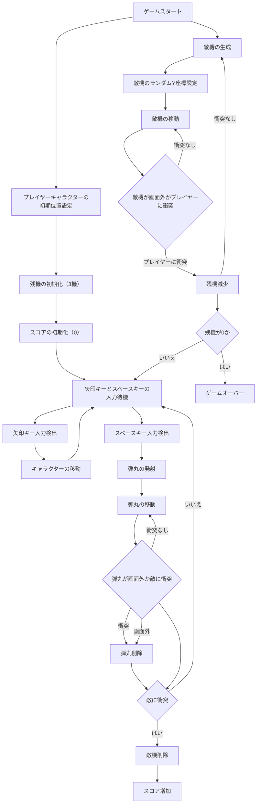

```mermaid
graph TD
    A[ゲームスタート] --> B[プレイヤーキャラクターの初期位置設定]
    B --> C[残機の初期化（3機）]
    C --> D[スコアの初期化（0）]
    D --> E[矢印キーとスペースキーの入力待機]
    E --> F[矢印キー入力検出]
    F --> G[キャラクターの移動]
    G --> E
    E --> H[スペースキー入力検出]
    H --> I[弾丸の発射]
    I --> J[弾丸の移動]
    J --> K{弾丸が画面外か敵に衝突}
    K -->|衝突なし| J
    K -->|衝突| L[弾丸削除]
    L --> M{敵に衝突}
    M -->|はい| N[敵機削除]
    N --> O[スコア増加]
    M -->|いいえ| E
    A --> P[敵機の生成]
    P --> Q[敵機のランダムY座標設定]
    Q --> R[敵機の移動]
    R --> S{敵機が画面外かプレイヤーに衝突}
    S -->|衝突なし| R
    S -->|プレイヤーに衝突| T[残機減少]
    T --> U{残機が0か}
    U -->|はい| V[ゲームオーバー]
    U -->|いいえ| E
    T -->|衝突なし| P
    K --> M
    K -->|画面外| L
```
