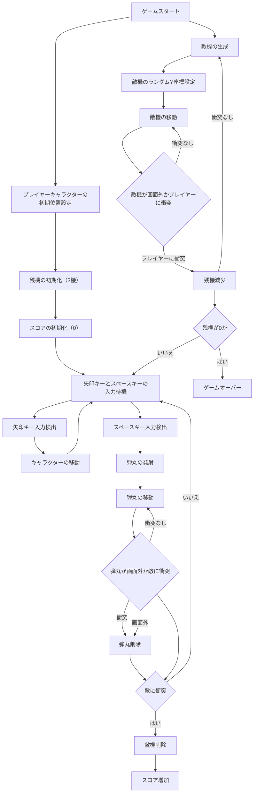

横方向シューティングゲームの設計をマーメイド記法で記述します。以下に示すのは、ゲームの主要な機能とそのフローチャートです：

ゲームの開始と初期設定
プレイヤーキャラクターの操作（上下左右矢印キーとスペースキー）
弾丸の発射
敵機の生成と移動
衝突判定（弾丸と敵機、敵機とプレイヤーキャラクター）
残機の管理とスコアのカウント
これらの要素をマーメイド記法でフローチャートにします。
```
graph TD
    A[ゲームスタート] --> B[プレイヤーキャラクターの初期位置設定]
    B --> C[残機の初期化（3機）]
    C --> D[スコアの初期化（0）]
    D --> E[矢印キーとスペースキーの入力待機]

    E --> F[矢印キー入力検出]
    F --> G[キャラクターの移動]
    G --> E

    E --> H[スペースキー入力検出]
    H --> I[弾丸の発射]
    I --> J[弾丸の移動]
    J --> K{弾丸が画面外か敵に衝突}
    K -->|衝突なし| J
    K -->|衝突| L[弾丸削除]
    L --> M{敵に衝突}
    M -->|はい| N[敵機削除]
    N --> O[スコア増加]
    M -->|いいえ| E

    A --> P[敵機の生成]
    P --> Q[敵機のランダムY座標設定]
    Q --> R[敵機の移動]
    R --> S{敵機が画面外かプレイヤーに衝突}
    S -->|衝突なし| R
    S -->|プレイヤーに衝突| T[残機減少]
    T --> U{残機が0か}
    U -->|はい| V[ゲームオーバー]
    U -->|いいえ| E

    T -->|衝突なし| P

    K --> M
    K -->|画面外| L

```





このフローチャートは、横方向シューティングゲームの基本的な流れを示しています。プレイヤーキャラクターの操作、弾丸の発射、敵機の生成と移動、衝突判定、およびスコアと残機の管理が含まれています。

説明
ゲームスタート：

プレイヤーキャラクターの初期位置を設定し、残機を3に初期化し、スコアを0に初期化します。
プレイヤーキャラクターの操作：

矢印キー（上下左右）でキャラクターを移動します。
スペースキーを押すと弾丸を発射します。
弾丸の発射と移動：

スペースキーを押すと弾丸が発射され、前方に移動します。
弾丸が画面外に出るか敵に衝突すると弾丸は削除されます。
弾丸が敵に衝突した場合、敵も削除されスコアが増加します。
敵機の生成と移動：

敵機は右側のランダムなY座標から生成され、左方向に移動します。
敵機が画面外に出るかプレイヤーキャラクターに衝突すると敵機は削除されます。
敵機がプレイヤーキャラクターに衝突した場合、プレイヤーの残機が1減少します。
ゲームオーバー：

残機が0になるとゲームオーバーとなります。
このフローチャートを参考にして、実際のScratchプロジェクトで各機能を実装していくと、横方向シューティングゲームが完成します。
