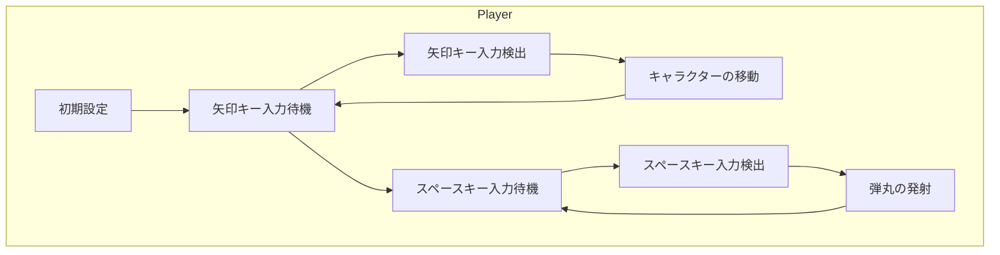
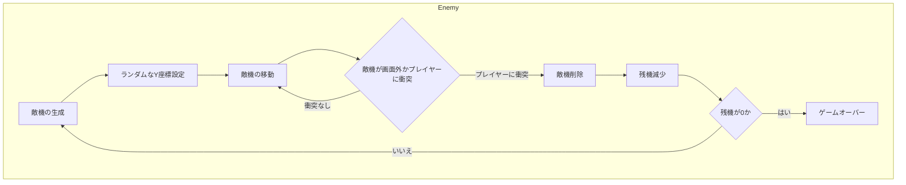
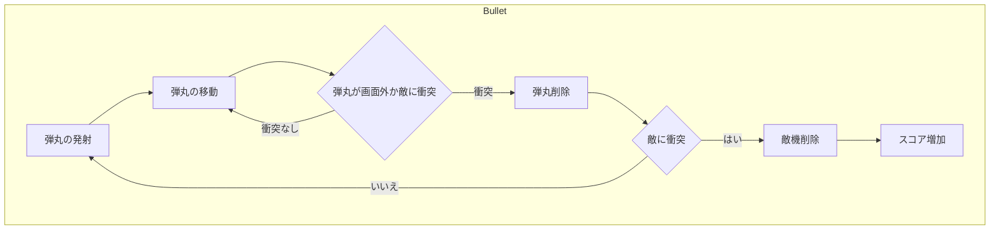

オブジェクトごとに設計をまとめると理解しやすくなります。以下に、プレイヤー、敵機、弾丸の3つのオブジェクトごとに分けて、マーメイド記法で設計を記述します。また、図を見やすくするために、スタイルを工夫します。

プレイヤーキャラクターの設計
```
graph TD
    subgraph Player
        A1[初期設定]
        A2[矢印キー入力待機]
        A3[矢印キー入力検出]
        A4[キャラクターの移動]
        A5[スペースキー入力待機]
        A6[スペースキー入力検出]
        A7[弾丸の発射]
        
        A1 --> A2
        A2 --> A3
        A3 --> A4
        A4 --> A2
        A2 --> A5
        A5 --> A6
        A6 --> A7
        A7 --> A5
    end
```




敵機の設計
```
graph TD
    subgraph Enemy
        B1[敵機の生成]
        B2[ランダムなY座標設定]
        B3[敵機の移動]
        B4{敵機が画面外かプレイヤーに衝突}
        B5[敵機削除]
        B6[残機減少]
        B7{残機が0か}
        B8[ゲームオーバー]
        
        B1 --> B2
        B2 --> B3
        B3 --> B4
        B4 -->|衝突なし| B3
        B4 -->|プレイヤーに衝突| B5
        B5 --> B6
        B6 --> B7
        B7 -->|はい| B8
        B7 -->|いいえ| B1
    end

```





弾丸の設計
```
graph TD
    subgraph Bullet
        C1[弾丸の発射]
        C2[弾丸の移動]
        C3{弾丸が画面外か敵に衝突}
        C4[弾丸削除]
        C5{敵に衝突}
        C6[敵機削除]
        C7[スコア増加]
        
        C1 --> C2
        C2 --> C3
        C3 -->|衝突なし| C2
        C3 -->|衝突| C4
        C4 --> C5
        C5 -->|はい| C6
        C6 --> C7
        C5 -->|いいえ| C1
    end

```




これで、プレイヤーキャラクター、敵機、弾丸の各オブジェクトごとの設計が視覚的にわかりやすくなりました。全体のフローチャートも統合して表示することで、ゲームの流れがより明確に把握できるようになっています。
